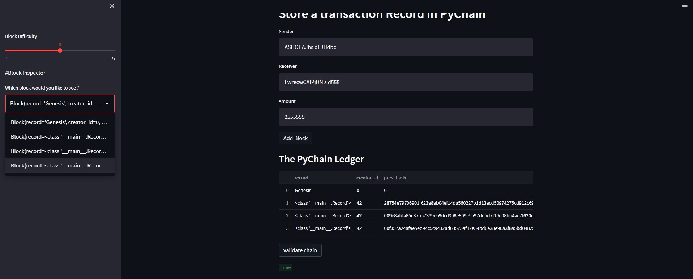

# Block-Chain
1. The aim of streamlit app is to provide a graphical user interface to visualize the submission of data and addition of the transaction in the ledger and then validating the transaction.
2. Following steps were performed for this purpose:
 1. Importing libraries and dependencies.
 2. Making a data class called 'Record' that have the attributes of:
     1. Sender
     2. Receiver
     3. Amount
 3. The next step is to make a data class called 'Block' which will take in the attributes related to the transaction and a function that will generate the hash of the transaction,
 4. Finally declaring a class called 'PyChain' which will add the transaction to the ledger and the same class will have the code for validating the transaction.
 5. Following picture gives the idea of the final outcome:
  